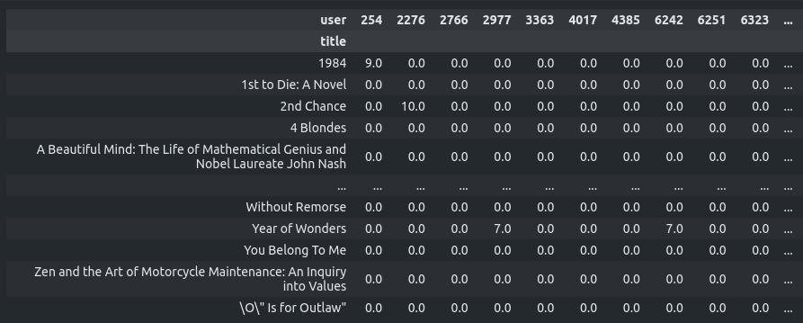

<h1> Book Recommendation Engine using KNN - ML Python Project</h1>
 
<h2>Features</h2>
<li>K-Nearest Neighbors algorithm</li>
<li>Cleanign the data</li>
<li>Developing a model that shows books that are similar to a given book</li>
<li>Remove from the dataset users with less than 200 ratings and books with less than 100 ratings</li>
<li>Function to return recommended books - this will be tested</li>
<h2>Acknowledgments</h2>

<b> Python3: http://bit.ly/python3-certifications <b>
 

<h2>Photo</h2>

 

<h2>Links</h2>
<li>FreeCodeCamp Project: https://www.freecodecamp.org/learn/machine-learning-with-python/machine-learning-with-python-projects/book-recommendation-engine-using-knn</li>
<h2>Contact</h2>

<b> Email: mariusc0023@gmail.com </b>
